

    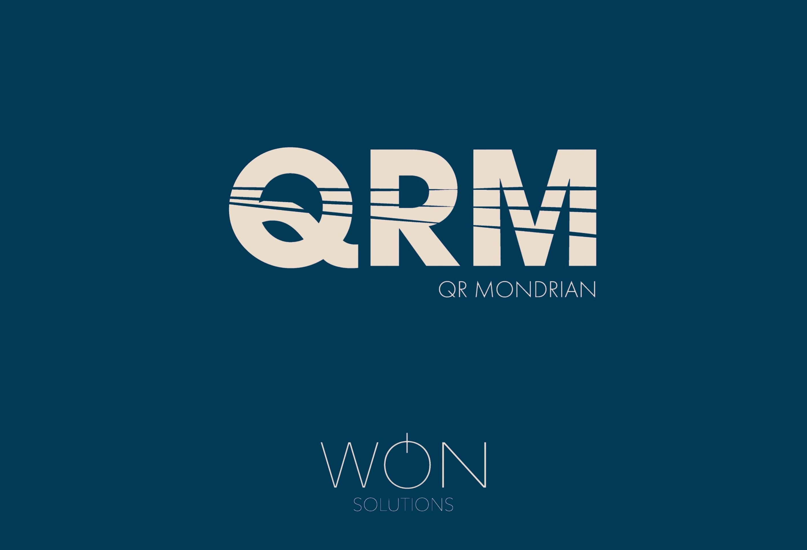
  

  
  <H3 align="center"> <i> An Easy-to-use Scan & Order System for Restaruants  </i></H3>
   
  
  ## Table of Contents
  1. [Description](#introduction)
  2. [Features](#features)
  3. [Design](#design)
  4. [Tech Stack](#techstack)
      1. [Frontend](#frontend)
      2. [Backend](#backend)
      3. [Cloud](#cloud)
  
  ## Description 
  "QR Mondrian" is a QR ordering system that boosts the dining experience and simplifies restaurant operations. Using QR code technology, customers can view menus and place orders directly from their phones.
  
  For customers, this system removes the usual wait for a server to provide the menu or take an order. They just scan a QR code, view the menu on their phones, and place their orders right away, saving time and increasing convenience.
  
  For restaurant owners, "QR Mondrian" brings a new level of efficiency. Owners can make real-time updates to menus and immediately stop orders when a dish runs out. This effective order management helps reduce errors and can also help decrease operational costs.
  
  In conclusion, "QR Mondrian" stands as a time-saving and cost-effective solution, redefining the dining and ordering process for customers and restaurant owners alike.
   
   
  
  <table>
      <tbody>
          <tr>
              <td colspan="3">
                  <b>QR Mondrian in Real-World Settings</b>
              </td>
          </tr>
          <tr>
             <td width="30%">
                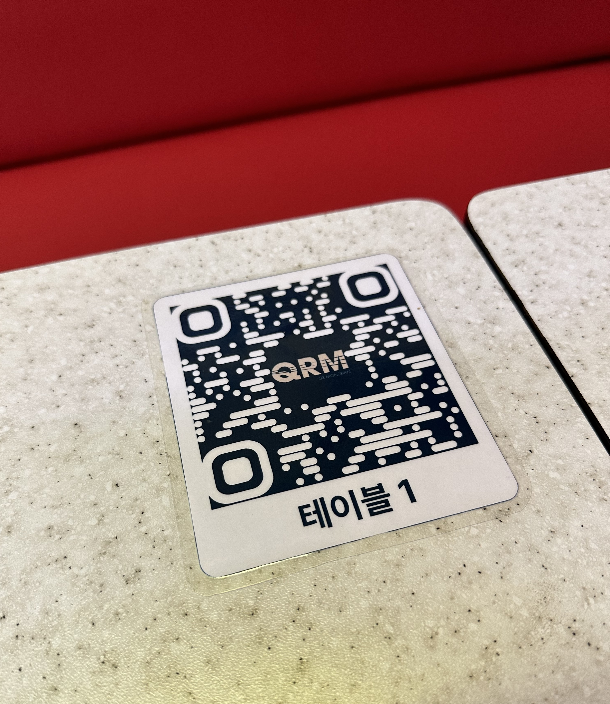
             </td>
             <td width="30%">
                 
             </td>
             <td width="40%">
                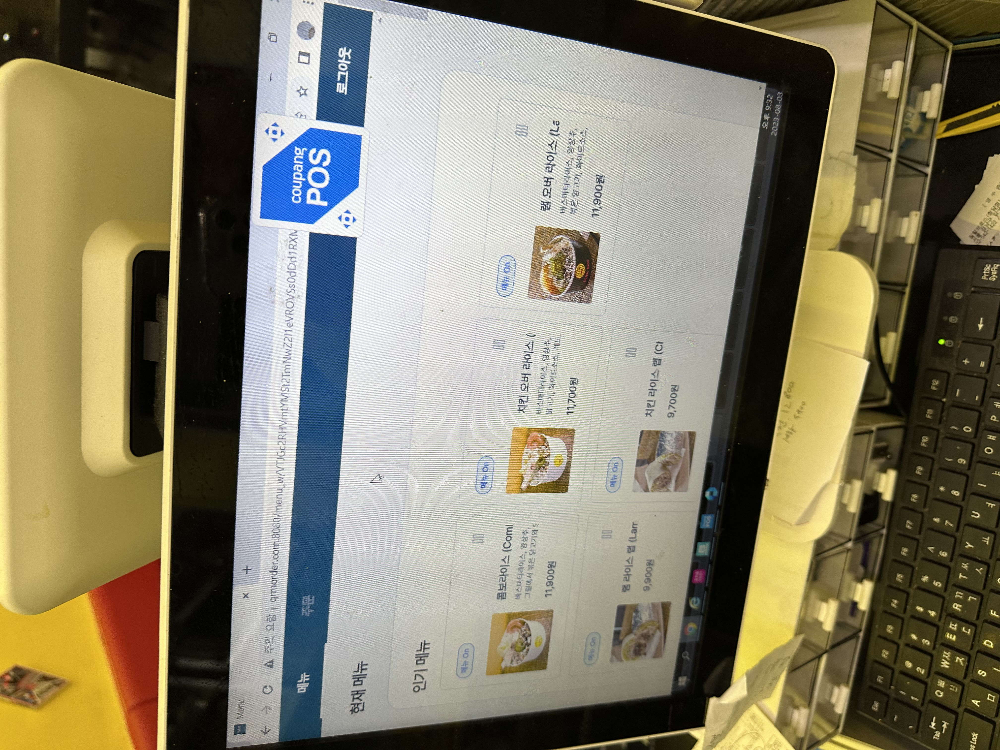
             </td>
          </tr>
         <tr>
             <td align="center">
                  QR Code attached to a table at a restaurant
             </td>
             <td align="center">
                  Video of user scanning QR code at a restaurant table to open the menu
             </td>
             <td align="center">
                  QR Mondrian being used on a computer in a restaurant's kitchen, alongside the POS system
             </td>
          </tr>
      </tbody>
  </table>
   
  
  ## Features 
  
  ### Mobile 
  <table>
      <tbody>
          <tr>
              <td>
                  <b>Mobile Menu Page</b>
                   
              </td>
          </tr>
          <tr>
             <td rowspan="1" width="750px">
                  

                      
                  

              </td>
          </tr>
          <tr>
              <td> 
                  On the Menu page, customers can easily check out menu offerings with a scroll bar for seamless navigation  
              </td>
          </tr>
      </tbody>
  </table>
  
  <table width="1200px">
      <tbody>
          <tr>
              <td>
                  <b>Mobile Menu Details Page</b>
                   
              </td>
          </tr>
          <tr>
              <td rowspan="1" width="750px">
                 

                      
                  

              </td>
          </tr>
          <tr>
              <td> 
                  On the Menu Details page, customers can view and select option items, select the quantity for each menu item, and add the menu item to the cart.
              </td>
          </tr>
      </tbody>
  </table>
  
  <table>
      <tbody>
          <tr>
              <td>
                  <b>Mobile Cart Page</b>
                   
              </td>
          </tr>
          <tr>
              <td rowspan="1" width="750px">
                  

                      
                  

              </td>
          </tr>
          <tr>
              <td> 
                  On the Cart Page, customers can edit menu item details, modify quantities, delete items, review past orders, and finally submit their current order.
              </td>
          </tr>
      </tbody>
  </table>
  
  ### Web 
  <table>
      <tbody>
          <tr>
              <td>
                  <b>Web Login Page</b>
                   
              </td>
          </tr>
          <tr>
              <td rowspan="1" width="750px">
                  

                      <a href="https://github.com/wonjunlim1/QR-Mondrian/tree/main/assets/readme/gifs/web_login_page.gif">
                          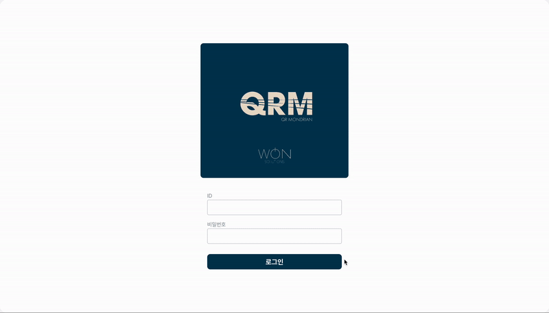
                      </a>
                  

              </td>
          </tr>
          <tr>
              <td> 
                  On the Login Page, users from either the restaurant's "HQ" or a "Branch" can log in with unique credentials. I have established a structure of permissions that distinguishes between HQ and Branch-level access, thereby ensuring appropriate access control within our system.
              </td>
          </tr>
      </tbody>
  </table>
  
  <table>
      <tbody>
          <tr>
              <td>
                  <b>Web Menu Page(HQ)</b>
                   
              </td>
          </tr>
          <tr>
              <td rowspan="1" width="750px">
                  

                      
                  

              </td>
          </tr>
          <tr>
              <td> 
                  On the Menu Page (for HQ-access users), users have the ability to view current offered menus, as well as delete menu categories or individual menu items.
              </td>
          </tr>
      </tbody>
  </table>
  
  <table>
      <tbody>
          <tr>
              <td>
                  <b>Web Menu Add Page(HQ)</b>
                   
              </td>
          </tr>
          <tr>
              <td rowspan="1" width="750px">
                  

                      
                  

              </td>
          </tr>
          <tr>
              <td> 
                  On the Menu Add Page (for HQ-access users), users can input details such as name, price, description, and category. Additionally, they can create associated option menus and upload a photo to enrich the new menu item.
              </td>
          </tr>
      </tbody>
  </table>
  
  <table>
      <tbody>
          <tr>
              <td>
                  <b>Web Edit Page(HQ)</b>
                   
              </td>
          </tr>
          <tr>
              <td rowspan="1" width="750px">
                  

                      <a href="https://github.com/wonjunlim1/QR-Mondrian/tree/main/assets/readme/gifs/web_menu_edit_page_hq.gif">
                          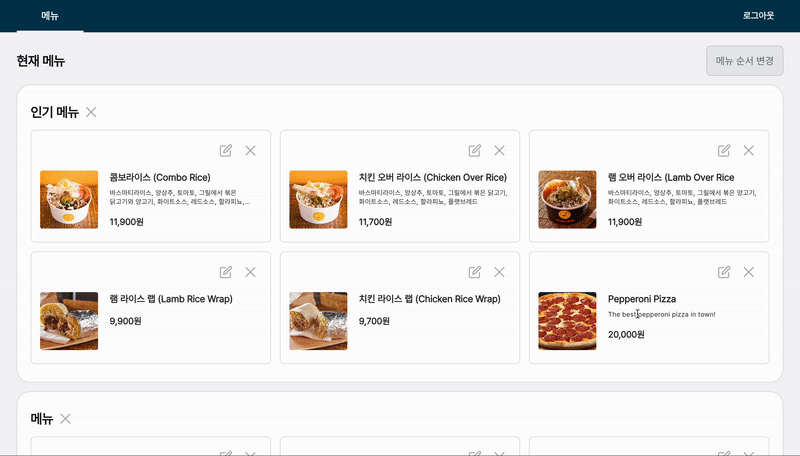
                      </a>
                  

              </td>
          </tr>
          <tr>
              <td> 
                  On the Menu Edit Page (for HQ-access users), users can update details such as name, price, description, and category. They can also modify associated option menus and update the menu item's photo as needed.
              </td>
          </tr>
      </tbody>
  </table>
  
  <table>
      <tbody>
          <tr>
              <td>
                  <b>Web Menu Display Order Edit Page(HQ)</b>
                   
              </td>
          </tr>
          <tr>
              <td rowspan="1" width="750px">
                  

                      
                  

              </td>
          </tr>
          <tr>
              <td> 
                  On the Menu Display Order Edit Page (for HQ-access users), users can rearrange the display order of menu categories and items. They also have the ability to add new menu categories when needed.
              </td>
          </tr>
      </tbody>
  </table>
  
  <table>
      <tbody>
          <tr>
              <td>
                  <b>Web Menu Page(Branch)</b>
                   
              </td>
          </tr>
          <tr>
              <td rowspan="1" width="750px">
                  

                      <a href="https://github.com/wonjunlim1/QR-Mondrian/tree/main/assets/readme/gifs/web_menu_page_branch.gif">
                          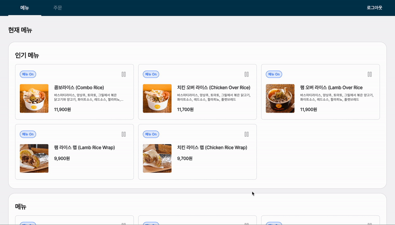
                      </a>
                  

              </td>
          </tr>
          <tr>
              <td> 
                  On the Menu Page (for Branch-access users), users can view the currently offered menus, stop menu items if they've run out of stock, and reactivate them once they're available again.
              </td>
          </tr>
      </tbody>
  </table>
  
  <table>
      <tbody>
          <tr>
              <td>
                  <b>Web Order Page(Branch)</b>
                   
              </td>
          </tr>
          <tr>
              <td rowspan="1" width="750px">
                  

                      <a href="https://github.com/wonjunlim1/QR-Mondrian/tree/main/assets/readme/gifs/web_order_page_branch.gif">
                          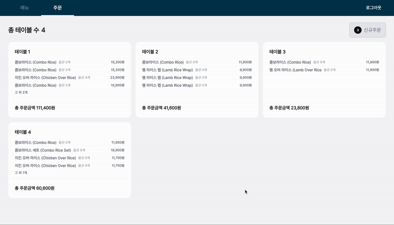
                      </a>
                  

              </td>
          </tr>
          <tr>
              <td> 
                  On the Order Page (for Branch-access users), users can monitor the ongoing orders for each table, manage incoming orders by accepting or rejecting them, and close orders when the customer has completed their payment and left.
              </td>
          </tr>
      </tbody>
  </table>
   
  
  ## Design 
  
  ### Design
  
  <table>
      <tr>
          <td>
              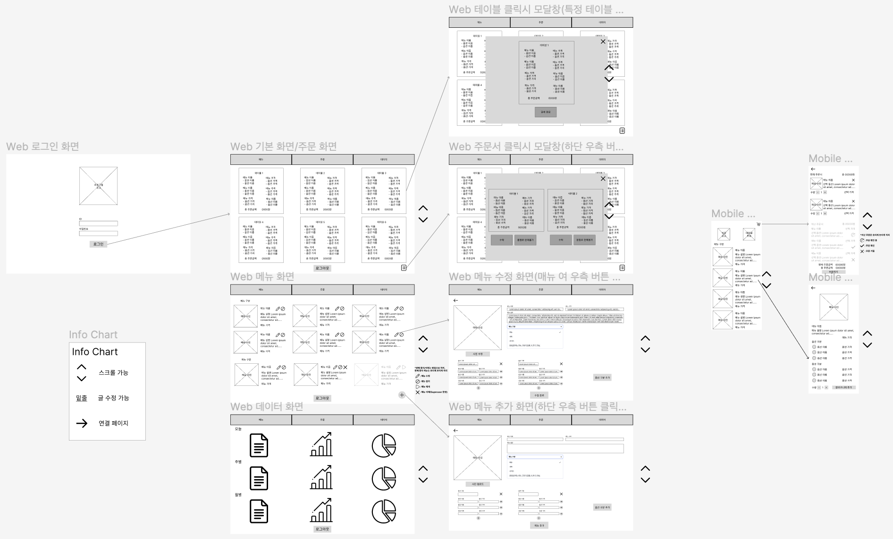
          </td>
          <td>
              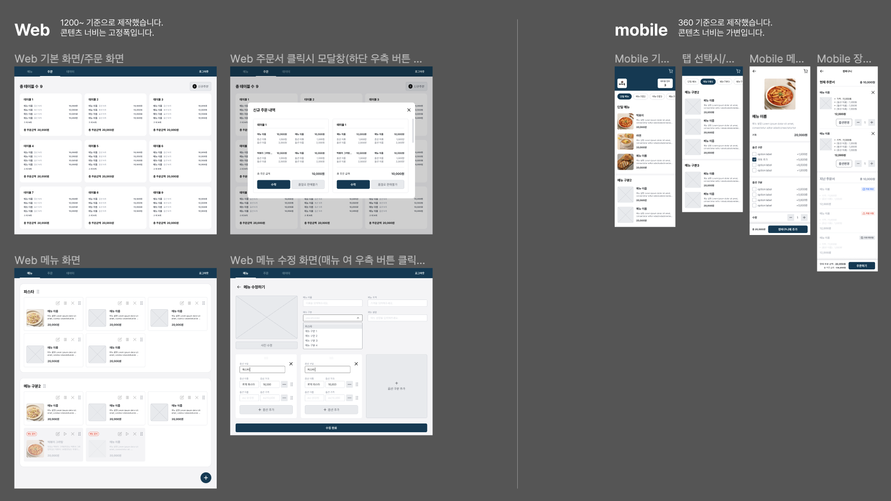
          </td>
      </tr>
      <tr>
          <td align="center">
              <a href="https://www.figma.com/file/iI0nOUBhGlFyCYAuTRejUd/Initial-Wireframe?type=design&node-id=0%3A1&mode=design&t=42ftTdJPHl690vdz-1">Initial Wireframe</a>
          </td>
          <td align="center">
              <a href="https://www.figma.com/file/qyP48DpYLIlmFCLPC4oYa6/Final-Mockup?type=design&node-id=0%3A1&mode=design&t=42ftTdJPHl690vdz-1">Final Mockup</a>
          </td>
      </tr>
    <tr>
          <td>
              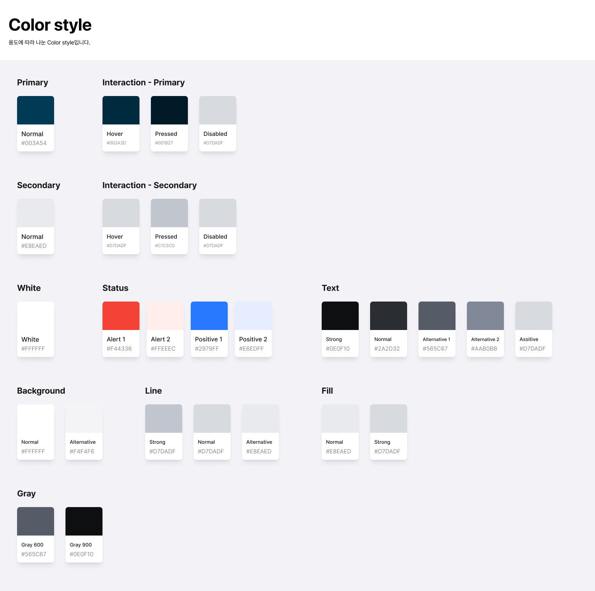
          </td>
          <td>
              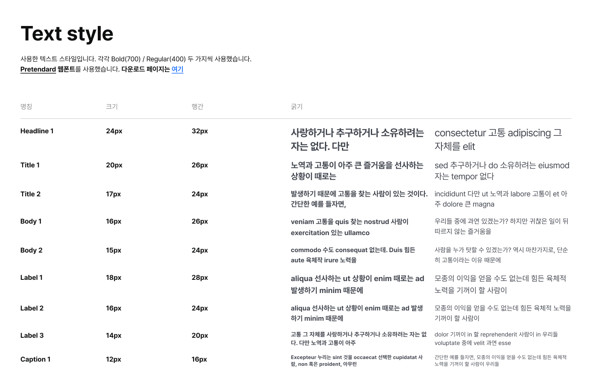
          </td>
      </tr>
      <tr>
          <td align="center">
              <a href="https://www.figma.com/file/qyP48DpYLIlmFCLPC4oYa6/Final-Mockup?type=design&node-id=1%3A2248&mode=design&t=42ftTdJPHl690vdz-1">Color Style Guide</a>
          </td>
          <td align="center">
              <a href="https://www.figma.com/file/qyP48DpYLIlmFCLPC4oYa6/Final-Mockup?type=design&node-id=1%3A2249&mode=design&t=42ftTdJPHl690vdz-1">Text Style Guide</a>
          </td>
      </tr>
  </table>
  
  Figma was utilized in the design process due to its cloud-based platform and versatile features, offering flexibility to design from any location. A style guide and text guide were created to ensure uniformity and consistency in visuals and text across the application.
  
  The design was crafted with an aim to be user-friendly and intuitive. A fixed color scheme and the use of intuitive icons formed part of this strategy, facilitating an effortless navigation experience for both restaurants and customers.
  
  Designing these elements in advance proved highly beneficial for the frontend development process. With a pre-defined layout, colors, typography, and icons, the coding process was streamlined and ensured alignment with the design vision, culminating in a cohesive and user-friendly application.
  
  Shown below is a representation of how this design was implemented in the project.
  
  ### Implementation of Design
  #### Mobile
  <table>
      <tbody>
          <tr>
              <td width = "250px">
                  <a href="https://github.com/wonjunlim1/QR-Mondrian/tree/main/assets/readme/pages/mobile_menu_page.png">
                      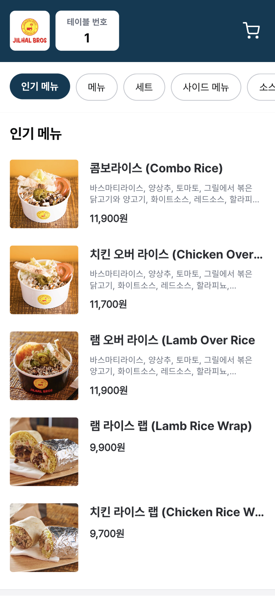
                  </a>
              </td>
              <td width = "250px">
                  <a href="https://github.com/wonjunlim1/QR-Mondrian/tree/main/assets/readme/pages/mobile_menu_details_page.png">
                      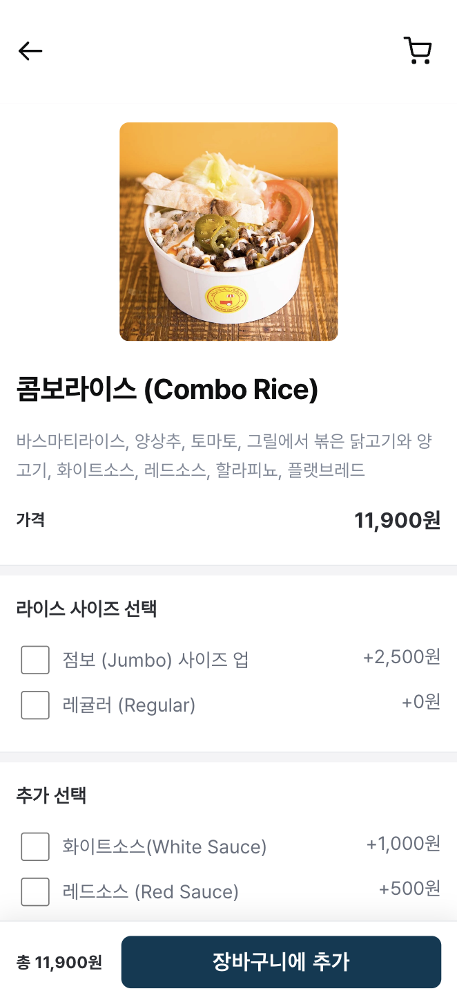
                  </a>
              </td>
              <td width = "250px">
                  <a href="https://github.com/wonjunlim1/QR-Mondrian/tree/main/assets/readme/pages/mobile_cart_page.png">
                      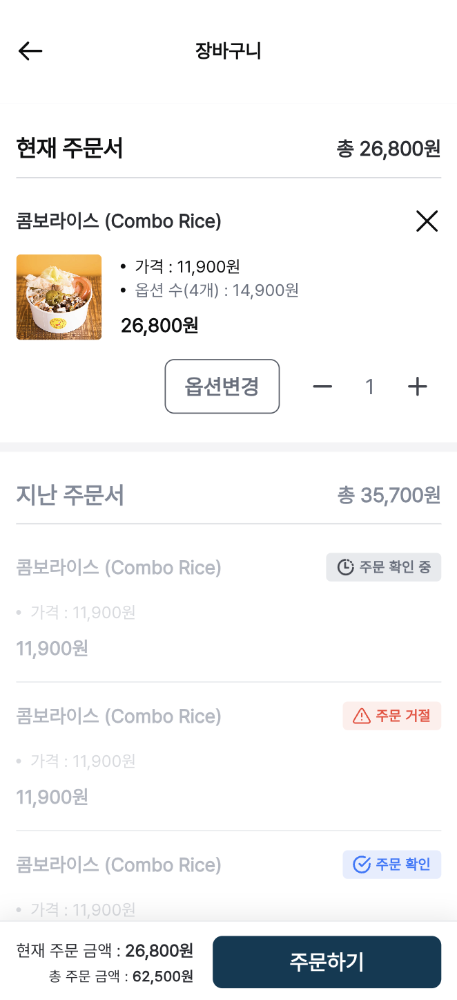
                  </a>
              </td>
          </tr>
          <tr>
              <td align = "center">Mobile Menu Page</td>
              <td align = "center">Mobile Menu Details Page</td>
              <td align = "center"> Mobile Cart Page</td>
          </tr>
      </tbody>
  </table>
  
  #### Web
  <table>
      <tbody>
          <tr>
              <td colspan="2" align="center">
                  <a href="https://github.com/wonjunlim1/QR-Mondrian/tree/main/assets/readme/pages/web_login_page.png">
                      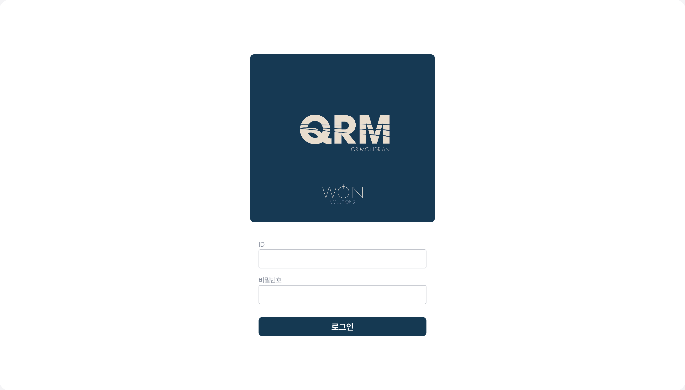
                  </a>
              </td>
          </tr>
          <tr>
              <td colspan="2" align="center">Web Login Page</td>
          </tr>
          <tr>
              <td>
                  <a href="https://github.com/wonjunlim1/QR-Mondrian/tree/main/assets/readme/pages/web_menu_page_hq.png">
                      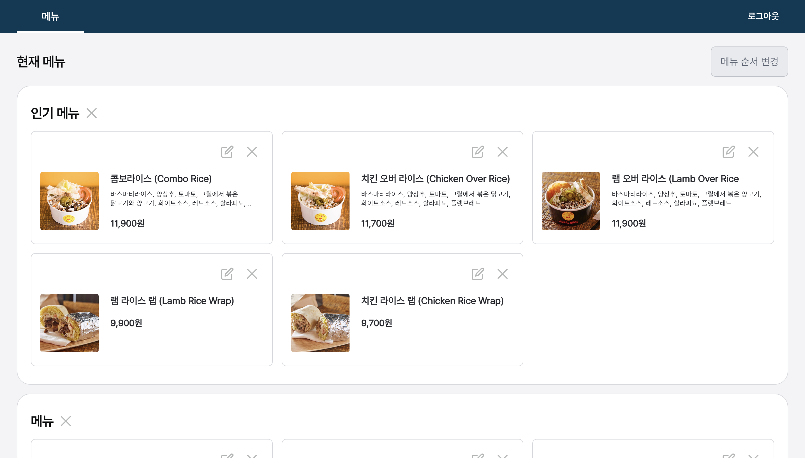
                  </a>
              </td>
              <td>
                  <a href="https://github.com/wonjunlim1/QR-Mondrian/tree/main/assets/readme/pages/web_menu_add_page_hq.png">
                      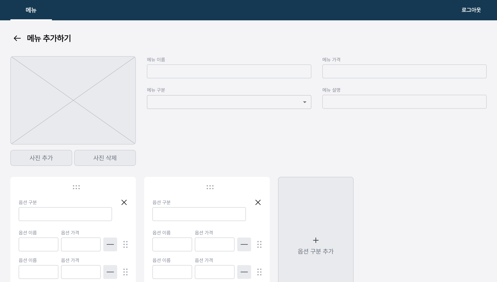
                  </a>
              </td>
          </tr>
          <tr>
              <td align="center">Web Menu Page(HQ)</td>
              <td align="center">Web Menu Add Page(HQ)</td>
          </tr>
          <tr>
              <td>
                  
              </td>
              <td>
                  <a href="https://github.com/wonjunlim1/QR-Mondrian/tree/main/assets/readme/pages/web_menu_display_order_edit_page_hq.png">
                      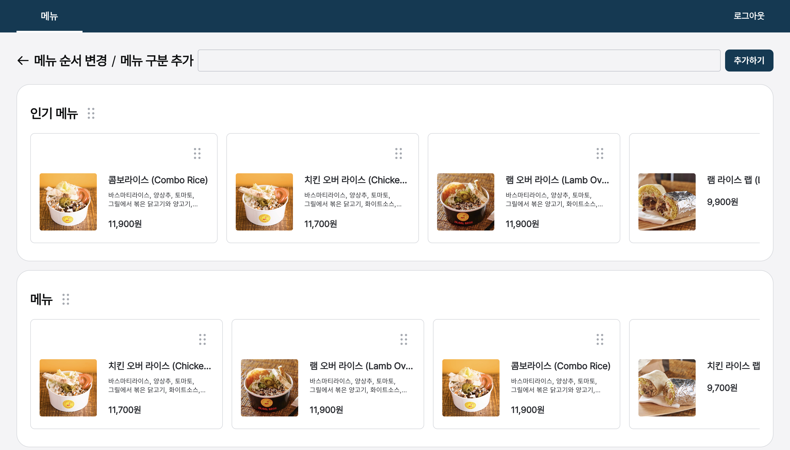
                  </a>
              </td>
          </tr>
          <tr>
              <td align="center">Web Menu Edit Page(HQ)</td>
              <td align="center">Web Menu Display Order Edit Page(HQ)</td>
          </tr>
          <tr>
              <td>
                  
              </td>
              <td>
                  <a href="https://github.com/wonjunlim1/QR-Mondrian/tree/main/assets/readme/pages/web_menu_page_hq.png">
                      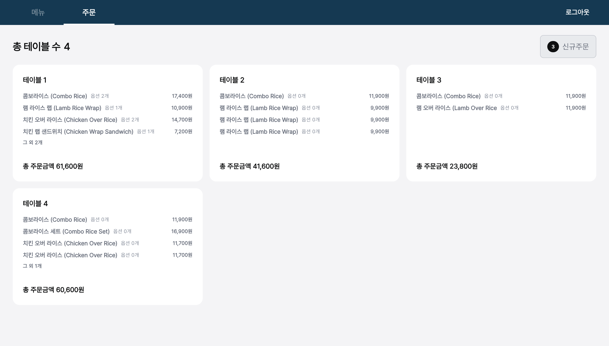
                  </a>
              </td>
          </tr>
          <tr>
              <td align="center">Web Menu Page(Branch)</td>
              <td align="center">Web Order Page(Branch)</td>
          </tr>
      </tbody>
  </table>
   
  
  ## Tech Stack 
  
  ### **Frontend** 
  
  |React|
  |:---:|
  ||
  
  <table>
      <tr>
          <td width="33%">
              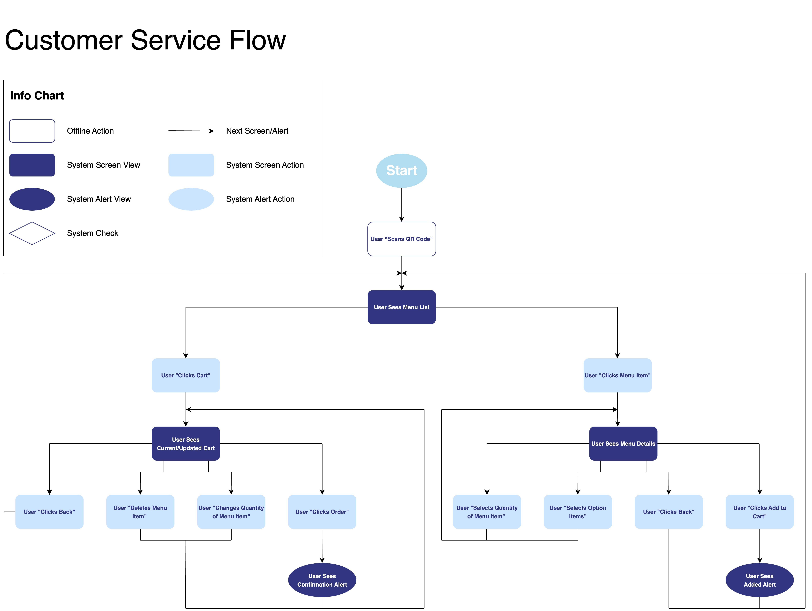
          </td>
          <td width="67%">
              
          </td>
      </tr>
      <tr>
          <td align="center">
              <a href="https://drive.google.com/file/d/1wtpR2PCCuPEl5Lq7ODCvMy5uxFw5hArr/view?usp=sharing">Customer Userflow</a>
          </td>
          <td align="center">
              <a href="https://drive.google.com/file/d/1PkmjmGlSpFRuUuk1BzAKiWPPfsHJhS0A/view?usp=sharing">Restaurant Userflow</a>
          </td>
      </tr>
  </table>
  
  React was selected for this project due to its efficiency, flexibility, and robust capabilities. As a JavaScript library designed for building user interfaces, React helps to create a smoother, faster user experience.
  
  React's virtual DOM is a key feature that improves application performance. It minimizes direct changes to the actual DOM, leading to faster and more efficient rendering of web pages. This was an essential factor in ensuring a seamless user experience, whether for customers browsing the menu or restaurants managing their orders.
  
  The user flow was carefully designed with the intent of providing an intuitive and effortless navigation experience for both customers and restaurants.
  
  The 'Customer Userflow' details the steps a customer would take, starting from scanning the QR code to placing an order, while the 'Restaurant Userflow' outlines the process for restaurants to efficiently manage their orders and menus. Both these user flows were thoughtfully designed, keeping in mind the potential needs and actions of the end users, ensuring their journey through the application is as smooth as possible.
  
  #### List of Libraries in Use
  
  |Library|Usage 
  |:---:|:---:|
  |[@mui/material](https://www.npmjs.com/package/@mui/material)| Used to create UI elements like dropdown lists |
  |[amazon-cognito-identity-js](https://www.npmjs.com/package/amazon-cognito-identity-js)| Connects to AWS Cognito for user login |
  |[crypto-js](https://www.npmjs.com/package/crypto-js)| Used to encode and decode URLs for additional security |
  |[jwt-decode](https://www.npmjs.com/package/jwt-decode)| Used for decode JWT tokens for handling user login |
  |[react-beautiful-dnd](https://www.npmjs.com/package/react-beautiful-dnd)| Used to implement drag and drop functionality |
   
  
  ### **Backend** 
  
  |Node.js|
  |:---:|
  ||
  
  <table>
      <tr>
          <td>
              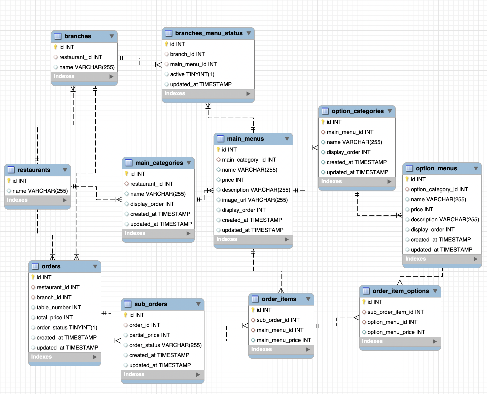
          </td>
      </tr>
      <tr>
          <td align="center">
              <a href="https://dbdiagram.io/d/64ca9d2302bd1c4a5e2395dd">Database Structure</a>
          </td>
      </tr>
  </table>
  
  #### Description of Tables
  
  qr_mondrian_schema:\
  &nbsp; - **restaurants**: basic information about different restaurants\
  &nbsp; - **branches**: information about the various branches of each restaurant\
  &nbsp; - **branches_menu_status**: the status of menus at different branches\
  &nbsp; - **main_categories**: the main categories of menus in each restaurant\
  &nbsp; - **main_menus**: the main menus under each category for the restaurants\
  &nbsp; - **option_categories**: the various option categories under each main menu item\
  &nbsp; - **option_menus**: the various option menus under each option category\
  &nbsp; - **orders**: the details of customer orders at each branch\
  &nbsp; - **sub_orders**: sub orders that make up a order\
  &nbsp; - **order_items**: information about the items included in each sub order\
  &nbsp; - **order_item_options**: the option items chosen for each order item
  
  The backend of the project was built using Node.js, appreciated for its efficiency, scalability, and seamless integration with React.js. Node.js facilitates the creation of a high-performance server capable of handling concurrent requests, crucial for a real-time application like this one, catering to multiple restaurants and customers.
  
  The design of the database incorporated a hierarchical structure for menus, beginning at the broadest level and moving down to more specific details. This structure started with "main_categories", followed by "main_menus". Each main menu then branched out to various "option_categories", each of which housed specific "option_menus". This organized architecture facilitated efficient data retrieval and ensured a clear layout for menu items.
  
  A similar hierarchical structure was implemented for orders. It began with an overall order that a customer placed during their visit to the restaurant. Accounting for the possibility of customers placing multiple orders during their visit, each "order" was divided into "sub_orders". This arrangement allowed customers to incrementally add to their order, similar to running a "tab", before finalizing the payment. Each sub-order comprised multiple "order items", with each order item potentially having several selected option items, stored under "order_item_options".
  
  Restaurants and branch details were stored in dedicated tables, ensuring efficient and accurate lookups. Similarly, to optimize performance, branch_menu_status was separated from the main_menu table.
  
  In line with the principle of single responsibility, each table in the database was designed to hold a specific set of data, serving one purpose. Such a division enhanced data integrity, clarity, and the efficiency of database operations.
  
  The backend API, conforming to RESTful principles, supported all CRUD operations: GET, PUT, POST, and DELETE, ensuring standardized practices for data interaction. The API endpoints were logically segmented based on functionality, simplifying use and maintenance.
  
  #### APIs
  
  | Type | View | Method | Feature | URL |
  | ---- |  ---- | ---- | ---- | ---- |
  | Universal | Web/Mobile Menu View| GET | [Get all menu](https://github.com/wonjunlim1/QR-Mondrian/wiki/Get-all-menu) | `/menu/:restaurant_id/:branch_id/:table_number/`|✅|
  | Universal | Web/Mobile Menu Details View | GET | [Get menu details](https://github.com/wonjunlim1/QR-Mondrian/wiki/Get-menu-details) | `/menu/:restaurant_id/:branch_id/:table_number/:menu_id/`|✅|
  | Mobile | Cart View | GET | [Get past orders](https://github.com/wonjunlim1/QR-Mondrian/wiki/Get-past-orders) | `/cart_m/:restaurant_id/:branch_id/:table_number/`| ✅|
  | Mobile | Cart View | POST | [Post current order](https://github.com/wonjunlim1/QR-Mondrian/wiki/Post-current-order) | `/cart_m/:restaurant_id/:branch_id/:table_number/`|✅|
  | Web | Order View | GET | [Get all orders](https://github.com/wonjunlim1/QR-Mondrian/wiki/Get-all-orders) | `/order_w/:restaurant_id/:branch_id/`|✅|
  | Web | Order View | PUT | [Update order status](https://github.com/wonjunlim1/QR-Mondrian/wiki/Update-order-status) | `/order_w/:restaurant_id/:branch_id/`|✅|
  | Web | Menu View | PUT | [Update menu status](https://github.com/wonjunlim1/QR-Mondrian/wiki/Update-menu-status) | `/menu_w/:restaurant_id/:branch_id/status`|✅|
  | Web | Menu View | DELETE | [Delete menu or category](https://github.com/wonjunlim1/QR-Mondrian/wiki/Delete-menu-or-category) | `/menu_w/:restaurant_id/:branch_id/request_type/:request_id`|✅|
  | Web | Menu Display Order Edit View | POST | [Create new category](https://github.com/wonjunlim1/QR-Mondrian/wiki/Create-new-category) | `/menu_w/:restaurant_id/:branch_id/category`|✅|
  | Web | Menu Display Order Edit View | PUT | [Edit display order](https://github.com/wonjunlim1/QR-Mondrian/wiki/Edit-display-order) |  `/menu_w/:restaurant_id/:branch_id/display_order`|✅|
  | Web | Menu Add View | POST | [Create new menu](https://github.com/wonjunlim1/QR-Mondrian/wiki/Create-new-menu) | `/menu_w/:restaurant_id/:branch_id/menu`|✅|
  | Web | Menu Edit View | PUT | [Edit menu](https://github.com/wonjunlim1/QR-Mondrian/wiki/Edit-Menu) |  `/menu_w/:restaurant_id/:branch_id/:menu_id/menu`|✅|
  
  #### List of Libraries in Use
  
  |Library|Usage 
  |:---:|:---:|
  |[express](https://www.npmjs.com/package/express)| Application framework for building RESTful APIs  |
  |[@aws-sdk/client-s3](https://www.npmjs.com/package/aws-sdk)| AWS sdk for accessing S3 buckets|
  |[multer-s3](https://www.npmjs.com/package/multer)| Middleware to handle form-data when uploading images |
  |[sequelize](https://www.npmjs.com/package/sequelize)| ORM tool to handle database transactions |
   
  
  ### **Cloud** 
  
  |AWS|
  |:---:|
  ||
  
  <table>
      <tr>
          <td>
              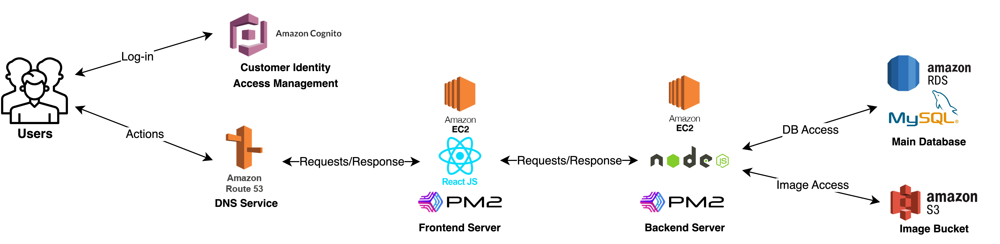
          </td>
      </tr>
      <tr>
          <td align="center">
              <a href="https://drive.google.com/file/d/1kV82iaBPt1sfN_dtzdvg5dQ6-JNbQNyn/view?usp=sharing">System Architecture</a>
          </td>
      </tr>
  </table>
  
  The cloud architecture for this project was constructed using Amazon Web Services (AWS), capitalizing on its extensive portfolio of scalable, integrated services, and its impressive industry prevalence. The need for a resilient and secure infrastructure that could effectively handle fluctuating load demands made AWS an obvious choice.
  
  The structure of the application was tailored to harness a selection of AWS services to achieve maximum functionality and efficiency. Amazon Cognito was implemented as a comprehensive Identity and Access Management (IAM) solution, ensuring secure user login and delivering a smooth user experience.
  
  Amazon Route53 was utilized to map the frontend EC2 server to a custom URL. This DNS service guaranteed reliable routing to the application, ensuring easy accessibility for users.
  
  Amazon EC2, an exceedingly configurable virtual server, was employed for hosting. Running in tandem with the process manager, PM2, it adeptly managed both frontend and backend services.
  
  Amazon RDS was selected for database services, with data stored in a MySQL database. It provided the advantages of automatic backups, software patching, and seamless scaling, all while maintaining high performance and availability.
  
  Lastly, Amazon S3 provided scalable object storage for storing the application's images, efficiently meeting the demands for high-volume storage and retrieval.
  
  Each of these components was chosen for its ability to enhance the application's performance, reliability, and user experience.
  
  #### List of Services in Use
  
  |Service|Usage| 
  |:---:|:---:|
  |[Amazon Cognito](https://aws.amazon.com/cognito/)| CIAM to handle user login |
  |[Amazon Route53](https://aws.amazon.com/route53/)| DNS service to map the frontend EC2 server to a custom URL |
  |[Amazon EC2](https://aws.amazon.com/ec2/)| Virtual server used alongside PM2 to host frontend and backend |
  |[Amazon RDS](https://aws.amazon.com/rds/)| Databse service(MySQL) to store data |
  |[Amazon S3](https://aws.amazon.com/s3/)| Storage service for images |
   
